# 🛡️ Agentic Data Sanitizer (Agentic Pipeline)

A premium **Agentic Data Sanitizer** application that converts "dirty" raw data into professional, validated insights. Powered by **Google Gemini** and **E2B Code Interpreter**, this agent follows a strict **Agentic Pipeline (Audit-Clean-Detect-Visualize)** to ensure that your visualizations are 100% accurate and free from data distortions.

---

## 🤔 Why "Agentic Data Sanitizer"?

Let’s be honest: Most data visualization tools are like a coat of paint on a crumbling wall. They look pretty, but the foundation is a mess. 

We called this the **Sanitizer** because:
1.  **Data is Filthy**: Real-world CSVs are digital dumpster fires—missing dates, random `$` signs, and "Electronics" vs "electronics" vs "ELECTR0NICS".
2.  **Visualizers are Liars**: If you plot dirty data, your charts are lying to you. A simple "visualizer" just draws whatever mess you give it.
3.  **We Do the Dirty Work**: While other agents are just "drawing pictures," this agent is in the trenches with a digital scrub brush, cleaning your data so your insights are actually true.

**It's not just a data agent; it's a digital hazmat suit for your analytics.** 🧼🛡️

---

## 🌟 Key Features

- **The Agentic Pipeline**: Sequential processing (Validation -> Preprocessing -> Anomaly Detection -> Visualization).
- **💡 AI Recommendation System**: Context-aware, colorful action chips that predict and structure powerful prompts based on your data schema.
- **Automated Data Audit**: Generates a **Health Score** and identifies missing values or type inconsistencies instantly.
- **Smart Data Treatment**: Automatically fixes currency symbols, handles missing data, and standardizes categorical names.

---

## 🏗️ System Architecture & Workflow

The following diagram illustrates the **Agentic Pipeline** and the **Context-Aware Recommendation Engine**:

```mermaid
flowchart TD
    %% Node Definitions
    User([👤 User])
    UI[🖥️ Streamlit Premium Dashboard]
    Recs[💡 AI Recommendation Engine]
    LLM[🧠 Google Gemini AI]
    Sandbox[🏗️ E2B Secure Sandbox]
    
    subgraph Pipeline [🛡️ Agentic Pipeline Architecture]
        direction TB
        V{{✅ 1. VALIDATION}}
        P{{🧹 2. PREPROCESSING}}
        A{{🔍 3. ANOMALY DETECTION}}
        Z{{📊 4. VISUALIZATION}}
        V --> P --> A --> Z
    end

    %% Connections
    User -->|Uploads Data| UI
    UI -->|Data Schema| Recs
    Recs -->|Powerful Suggestions| User
    User -->|Executes Prompt| UI
    UI -->|Data Context| LLM
    LLM -->|Python Code| Sandbox
    Sandbox -. executes .-> Pipeline
    
    Z -->|📈 Visuals| UI
    V -->|🛡️ Health Score| UI
    P -->|🧹 Cleaning Logs| UI

    %% Styling 
    classDef user fill:#e1f5fe,stroke:#01579b,stroke-width:2px;
    classDef ui fill:#fff9c4,stroke:#fbc02d,stroke-width:2px;
    classDef ai fill:#f3e5f5,stroke:#7b1fa2,stroke-width:2px;
    classDef sandbox fill:#eceff1,stroke:#455a64,stroke-width:2px;
    classDef pipe fill:#e8f5e9,stroke:#2e7d32,stroke-width:2px;
    classDef recs fill:#fff3e0,stroke:#e65100,stroke-width:2px;

    class User user;
    class UI ui;
    class LLM ai;
    class Sandbox sandbox;
    class V,P,A,Z pipe;
    class Recs recs;
```



### The Pipeline Stages:
1.  **Validation (The Audit)**: Checks for "Compliance." Are the columns correct? Is the health score high enough?
2.  **Preprocessing (The Treatment)**: Fixes the issues. Converts dates, fills missing values, and merges inconsistent categories.
3.  **Anomaly Detection (The Insight)**: Identifies the "weird" data points using 1.5 * IQR methodology.
4.  **Visualization (The Output)**: Plots clean, reliable data while highlighting anomalies.

---

## 🚀 Getting Started

### 1. Prerequisites
- Python 3.9+
- A Google Gemini API Key
- An E2B API Key

### 2. Installation & Setup
1. **Clone & Navigate**
   ```bash
   git clone <your-repo-url>
   cd <project-folder>
   ```
2. **Setup Dependencies**
   ```bash
   pip install -r requirements.txt
   ```
3. **Run the App**
   ```bash
   streamlit run app.py
   ```

---

## 🧪 Testing the Pipeline
This project includes two files for testing:
- **`test_sales_data.csv`**: A clean dataset for testing basic analysis.
- **`uncleaned_sales_data.csv`**: A "dirty" dataset with outliers, missing values, and case errors to test the **Agentic Pipeline's** cleaning power.

---

Built with ❤️ by **Aravind S Gudi**