# 🛡️ Agentic Data Sanitizer (Agentic Pipeline)

A premium **Agentic Data Sanitizer** application that converts "dirty" raw data into professional, validated insights. Powered by **Google Gemini** and **E2B Code Interpreter**, this agent follows a strict **Agentic Pipeline (Audit-Clean-Detect-Visualize)** to ensure that your visualizations are 100% accurate and free from data distortions.

---

## 🤔 Why "Agentic Data Sanitizer"?

Let’s be honest: Most data visualization tools are like a coat of paint on a crumbling wall. They look pretty, but the foundation is a mess. 

We called this the **Sanitizer** because:
1.  **Data is Filthy**: Real-world CSVs are digital dumpster fires—missing dates, random `$` signs, and "Electronics" vs "electronics" vs "ELECTR0NICS".
2.  **Visualizers are Liars**: If you plot dirty data, your charts are lying to you. A simple "visualizer" just draws whatever mess you give it.
3.  **We Do the Dirty Work**: While other agents are just "drawing pictures," this agent is in the trenches with a digital scrub brush, cleaning your data so your insights are actually true.

**It's not just a data agent; it's a digital hazmat suit for your analytics.** 🧼🛡️

---

## 🌟 Key Features

- **The Agentic Pipeline**: Sequential processing (Validation -> Preprocessing -> Anomaly Detection -> Visualization).
- **⚡ Quick Actions**: One-click analysis for Trends, Category Mix, and Full Audits.
- **Automated Data Audit**: Generates a **Health Score** and identifies missing values or type inconsistencies instantly.
- **Smart Data Treatment**: Automatically fixes currency symbols, handles missing data, and standardizes categorical names.
- **Anomaly Detection**: Uses statistical IQR methods to identify outliers and "Black Swan" events.
- **Secure Sandbox**: Executes all AI-generated Python code in isolated [E2B Sandboxes](https://e2b.dev/).
- **Premium UI/UX**: Includes a dedicated "Data Audit & Cleaning" log.

---

## 🏗️ System Architecture & Workflow

The following diagram illustrates the **Golden Pipeline** architecture of the AI Data Scientist:

```mermaid
flowchart TD
    User([👤 User]) -->|Prompt / Quick Action| UI[Streamlit Premium Dashboard]
    
    UI -->|Data Context| LLM[🧠 Google Gemini 1.5 Flash]
    LLM -->|Python Code| Sandbox[🛠️ E2B Code Interpreter]
    
    subgraph Agentic_Pipeline [🛡️ The Agentic Pipeline Architecture]
        direction TB
        Audit{{1. VALIDATION}} -->|Health Score| PreProcess{{2. PREPROCESSING}}
        PreProcess -->|Cleaned Data| Anomaly{{3. ANOMALY DETECTION}}
        Anomaly -->|Refined Insights| Viz{{4. VISUALIZATION}}
    end
    
    Sandbox -. executes .-> Agentic_Pipeline
    
    Viz -->|� Graphics| UI
    Audit -->|�️ Reports| UI
    PreProcess -->|� Logs| UI
```



### The Pipeline Stages:
1.  **Validation (The Audit)**: Checks for "Compliance." Are the columns correct? Is the health score high enough?
2.  **Preprocessing (The Treatment)**: Fixes the issues. Converts dates, fills missing values, and merges inconsistent categories.
3.  **Anomaly Detection (The Insight)**: Identifies the "weird" data points using 1.5 * IQR methodology.
4.  **Visualization (The Output)**: Plots clean, reliable data while highlighting anomalies.

---

## 🚀 Getting Started

### 1. Prerequisites
- Python 3.9+
- A Google Gemini API Key
- An E2B API Key

### 2. Installation & Setup
1. **Clone & Navigate**
   ```bash
   git clone <your-repo-url>
   cd <project-folder>
   ```
2. **Setup Dependencies**
   ```bash
   pip install -r requirements.txt
   ```
3. **Run the App**
   ```bash
   streamlit run app.py
   ```

---

## 🧪 Testing the Pipeline
This project includes two files for testing:
- **`test_sales_data.csv`**: A clean dataset for testing basic analysis.
- **`uncleaned_sales_data.csv`**: A "dirty" dataset with outliers, missing values, and case errors to test the **Agentic Pipeline's** cleaning power.

---

Built with ❤️ by **Aravind S Gudi**